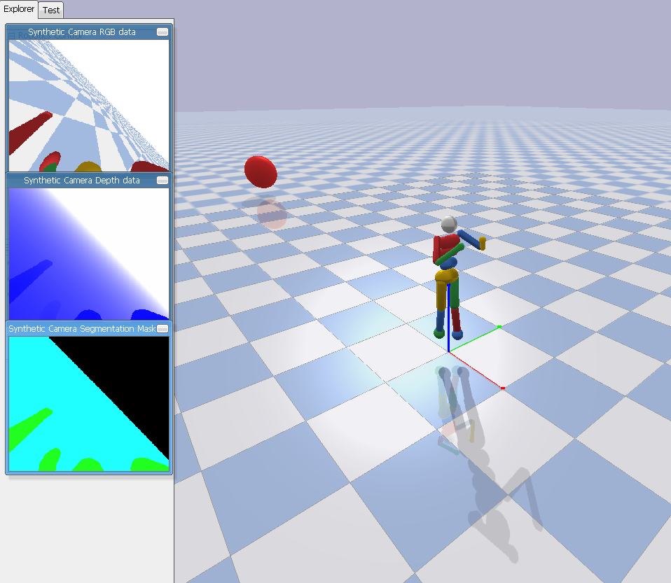
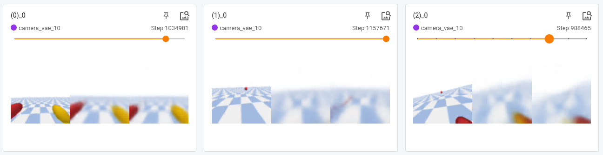

# ERL



Plan:

VAEs + RNNs + RL

# Progress

Save 10k camera images during RL training, train a VAE to reconstruct them.



## Useful commands

```bash
# Install dependencies:
pip install -r requirements.txt
# Install current project as a package:
pip install -e .
# Run the experiment
python run.py
# Run unittest:
pytest

```
## Issues
Tensorboard 2.4.1 is using `np.bool` and `np.object`, which are deprecated. 
To avoid warning, replace those by `bool` and `object`.

DeepGreen doesn't have CUDA 10.2, so I reinstall torch 1.7.1 with cu101.
```
# CUDA 10.1
pip install torch==1.7.1+cu101 torchvision==0.8.2+cu101 torchaudio==0.7.2 -f https://download.pytorch.org/whl/torch_stable.html
```
## DeepGreen commands

```
# allocate a node
srun -p dg-jup --gres=gpu:1 --pty bash
# load newest software pack
module load spack/spack-0.15.4
. $SPACK_ROOT/share/spack/setup-env.sh
spack load cuda
# run
python run.py
```